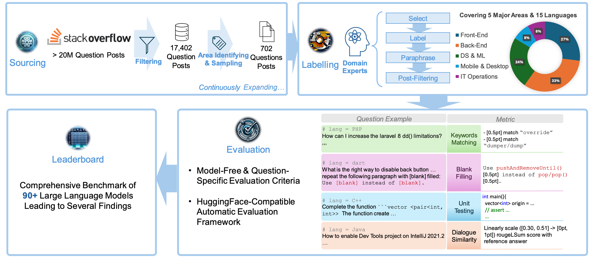
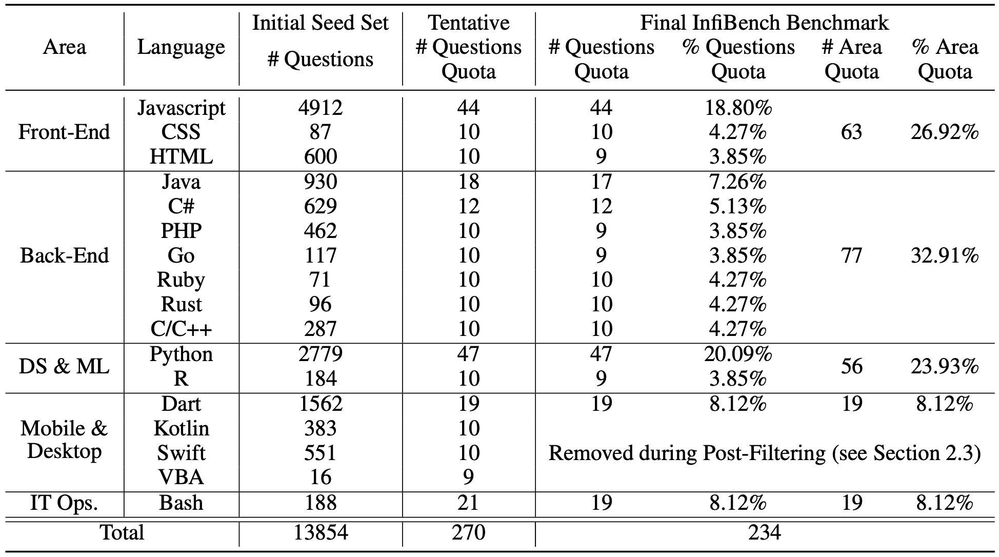
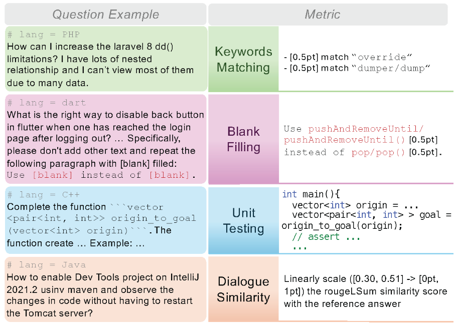
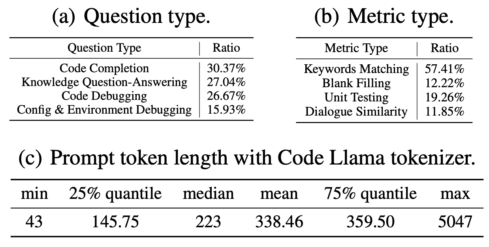
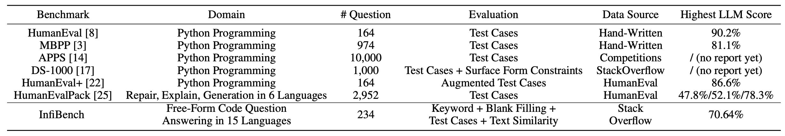
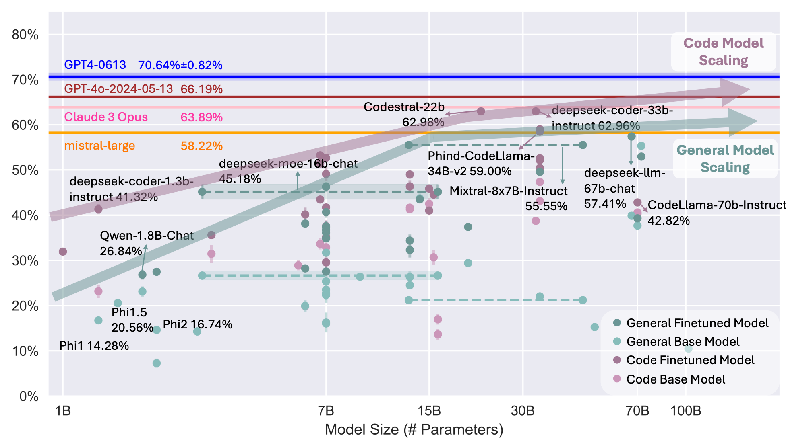

<html>

<head>
  <meta charset="utf-8">
  <meta name="description" content="IInfiBench: Evaluating the Question-Answering Capabilities of Code LLMs">
  <meta name="keywords" content="InfiCoder-Eval, code-generation, large-language-model, benchmark">
  <meta name="viewport" content="width=device-width, initial-scale=1">
  <title>InfiBench: Evaluating the Question-Answering Capabilities of Code LLMs</title>

  <link href="https://fonts.googleapis.com/css?family=Google+Sans|Noto+Sans|Castoro" rel="stylesheet">

  <link rel="stylesheet" href="./static/css/bulma.min.css">
  <link rel="stylesheet" href="./static/css/bulma-carousel.min.css">
  <link rel="stylesheet" href="./static/css/bulma-slider.min.css">
  <link rel="stylesheet" href="./static/css/fontawesome.all.min.css">
  <link rel="stylesheet" href="https://cdn.jsdelivr.net/gh/jpswalsh/academicons@1/css/academicons.min.css">
  <link rel="stylesheet" href="./static/css/index.css">

  <link rel="stylesheet" href="./bower_components/bootstrap/dist/css/bootstrap.table.min.css">
  <!--  <link rel="stylesheet" href="bower_components/bootstrap/dist/css/bootstrap.min.css">-->
  <link rel="stylesheet" href="./stylesheets/layout.css">
  <link rel="stylesheet" href="./stylesheets/index.css">

  <!-- for print the table -->
  

  <link rel="stylesheet" type="text/css" href="https://cdn.datatables.net/1.11.3/css/jquery.dataTables.css">
  

  <link rel="stylesheet" type="text/css" href="https://cdn.datatables.net/1.11.3/css/dataTables.bootstrap5.min.css">
  

  <link rel="icon" href="./static/images/inficoder_eval_logo2.png">

  
  
  
  
</head>

<body>

  <nav class="navbar" role="navigation" aria-label="main navigation">
    

      <a role="button" class="navbar-burger" aria-label="menu" aria-expanded="false">
        
        
        
      </a>
    

    

      

        <a class="navbar-item" href="https://github.com/infi-coder">
          
            <i class="fas fa-home"></i>
          
        </a>

        

          <a class="navbar-link">
            More
          </a>
          

            <a class="navbar-item" href="https://github.com/infi-coder">
              InfiCoder Organization
            </a>
          

        

      

    

  </nav>

  

    

      
    

  

  <section class="hero">
    

      

        

          

            <h1 class="title is-1 publication-title">InfiBench: Evaluating the Question-Answering Capabilities of Code LLMs
            </h1>
            

              <!-- 
                The InfiCoder Team
               -->
               
              
                <a href="https://linyil.com" target="_blank">Linyi Li</a>&nbsp;
                <a href="https://scholar.google.com/citations?user=wujqvGYAAAAJ&hl=en" target="_blank">Shijie Geng</a>&nbsp;
                *Zhenwen Li&nbsp;
                *Yibo He&nbsp;
                <a href="https://scholar.google.com/citations?user=Ns6QRcIAAAAJ&hl=zh-CN&oi=sra" target="_blank">*Hao Yu</a>&nbsp;
              
               
              
                *Ziyue Hua&nbsp;
                Guanghan Ning&nbsp;
                Siwei Wang&nbsp;
                <a href="https://taoxiease.github.io/" target="_blank">Tao Xie</a>&nbsp;
                <a href="https://www4.comp.polyu.edu.hk/~hongxyang/" target="_blank">Hongxia Yang</a>
              
              

              
                Simon Fraser University&nbsp;
                Rutgers University&nbsp;
                Peking University&nbsp; 
                ByteDance Inc&nbsp;
                The Hong Kong Polytechnic University 
                (* denotes to equal contribution)
              
            

            

              <!-- 1Caption of Quận 5, Ho Chi Minh City, Vietnam -->
              <!-- 2Peking University, -->
            

            

              

                <!-- PDF Link. -->
                
                  <a href="https://arxiv.org/abs/2404.07940" class="external-link button is-normal is-rounded is-dark" target="_blank">
                    
                      <i class="ai ai-arxiv"></i>
                    
                    Paper
                  </a>
                
                <!-- Dataset Link. -->
                
                  <a href="https://github.com/infi-coder/infibench-evaluation-harness/" class="external-link button is-normal is-rounded is-dark" target="_blank">
                    
                      <i class="fab fa-github"></i>
                    
                    Code
                  </a>
                  <!-- <a href="https://github.com/infi-coder/inficoder-eval-framework"
                     class="external-link button is-normal is-rounded is-dark" target='_blank'>
                    
                      <i class="fab fa-github"></i>
                    
                    Evaluation Repo
                  </a> -->
                
                <!-- Slides Link. -->
                
                  <a href="https://cs.sfu.ca/~linyi/res/pub/infibench_slides.pdf" class="external-link button is-normal is-rounded is-dark" target="_blank">
                    
                      <svg xmlns="http://www.w3.org/2000/svg" viewBox="0 0 512 512"  style="fill:white"><!--!Font Awesome Free 6.7.1 by @fontawesome - https://fontawesome.com License - https://fontawesome.com/license/free Copyright 2024 Fonticons, Inc.--><path d="M187.7 153.7c-34 0-61.7 25.7-61.7 57.7 0 31.7 27.7 57.7 61.7 57.7s61.7-26 61.7-57.7c0-32-27.7-57.7-61.7-57.7zm143.4 0c-34 0-61.7 25.7-61.7 57.7 0 31.7 27.7 57.7 61.7 57.7 34.3 0 61.7-26 61.7-57.7 .1-32-27.4-57.7-61.7-57.7zm156.6 90l-6 4.3V49.7c0-27.4-20.6-49.7-46-49.7H76.6c-25.4 0-46 22.3-46 49.7V248c-2-1.4-4.3-2.9-6.3-4.3-15.1-10.6-25.1 4-16 17.7 18.3 22.6 53.1 50.3 106.3 72C58.3 525.1 252 555.7 248.9 457.5c0-.7 .3-56.6 .3-96.6 5.1 1.1 9.4 2.3 13.7 3.1 0 39.7 .3 92.8 .3 93.5-3.1 98.3 190.6 67.7 134.3-124 53.1-21.7 88-49.4 106.3-72 9.1-13.8-.9-28.3-16.1-17.8zm-30.5 19.2c-68.9 37.4-128.3 31.1-160.6 29.7-23.7-.9-32.6 9.1-33.7 24.9-10.3-7.7-18.6-15.5-20.3-17.1-5.1-5.4-13.7-8-27.1-7.7-31.7 1.1-89.7 7.4-157.4-28V72.3c0-34.9 8.9-45.7 40.6-45.7h317.7c30.3 0 40.9 12.9 40.9 45.7v190.6z"/></svg>
                    
                    Slides
                  </a>
                
                <!-- Slides Link. -->
                
                  <a href="https://openreview.net/forum?id=E8EAeyTxOy#discussion" class="external-link button is-normal is-rounded is-dark" target="_blank">
                    
                      <svg xmlns="http://www.w3.org/2000/svg" viewBox="0 0 512 512"  style="fill:white"><!--!Font Awesome Free 6.7.1 by @fontawesome - https://fontawesome.com License - https://fontawesome.com/license/free Copyright 2024 Fonticons, Inc.--><path d="M224 96a160 160 0 1 0 0 320 160 160 0 1 0 0-320zM448 256A224 224 0 1 1 0 256a224 224 0 1 1 448 0z"/></svg>
                    
                    OpenReview
                  </a>
                
              

            

            

              <a href="https://neurips.cc/virtual/2024/poster/97797" target="_blank">Appear at NeurIPS 2024 Datasets and Benchmarks Track</a>
            

          

        

      

    

  </section>

  <section class="hero teaser">
    

      

        <h2 class="subtitle has-text-centered">
          InfiBench is a comprehensive benchmark for code large language models evaluating model ability on answering freeform real-world questions in the code domain.
        </h2>
        
      

    

  </section>

  <section class="section">
    

      <!-- Abstract. -->
      

        

          <h2 class="title is-3">Overview</h2>
          

            

              Large Language Models for code (code LLMs) have witnessed tremendous progress in recent years. 
              With the rapid development of code LLMs, many popular evaluation benchmarks, such as <a href="https://github.com/openai/human-eval">HumanEval</a>, <a href="https://ds1000-code-gen.github.io/">DS-1000</a>,
              and <a href="https://arxiv.org/abs/2108.07732">MBPP</a>, have emerged to measure the performance of code LLMs with a particular focus on code generation tasks. However, they are insufficient to cover the full range of expected capabilities of code LLMs, which span beyond code generation to answering diverse coding-related questions. To fill this gap, we propose InfiBench, the first large-scale freeform question-answering (QA) benchmark for code to our knowledge, comprising 234 carefully selected high-quality Stack Overflow questions that span across 15 programming languages. InfiBench uses four types of model-free automatic metrics to evaluate response correctness where domain experts carefully concretize the criterion for each question. We conduct a systematic evaluation for over 100 latest code LLMs on InfiBench, leading to a series of novel and insightful findings. Our detailed analyses showcase potential directions for further advancement of code LLMs. InfiBench is fully open source and continuously expanding to foster more scientific and systematic practices for code LLM evaluation.
            

          

        

      

      <!--/ Abstract. -->
    

  </section>

  <section class="section">
    

      <!-- Example. -->
      

        

          <h2 class="title is-3">Statistics and Examples</h2>
          

            

              InfiBench comprises 234 carefully picked high-quality Stack Overflow questions, covering 15 programming languages, and largely <b>following the natural question distribution of <a href="https://stackoverflow.com/">Stack Overflow</a></b>.
            

            

            

             
              We recruited five domain experts to create the benchmark and annotate the correctness evaluation criteria.
              Specifically, the InfiBench framework integrates four types of model-free metrics for evaluating the correctness: keywords matching, blank filling, unit testing, and dialogue similarity.
            

            

            

             
              Below is the question type, metric type, and length statistics.
            

            

              
            

          

        

      

      <!--/ Example. -->
    

  </section>

  <section class="section">
    

      <!-- Comparison. -->
      

        

          <h2 class="title is-3">Comparison</h2>
          

            
Existing benchmarks weigh heavily on code generation, unit-test-based evaluation, and a limited set of programming languages. InfiBench processes a much higher diversity to reflect real-world code LLMs’ usage scenarios and is far from saturation.

            
          

        

      

      <!--/ Comparison. -->
    

  </section>

  <section class="section">
    

      <!-- Perturbation and Prompt. -->
      

        

          <h2 class="title is-3">Prompts and Evaluation Protocol</h2>
          

            Each question contains a system prompt and content prompt.
            For questions whose responses are mainly in natural language, the system prompt is
            

              

                <code>You are a professional assistant for programmers. By default, questions and answers are in Markdown format. You are chatting with programmers, so please answer as briefly as possible.
                </code>
              

            

            For other questions, the system prompt is
            

              

                <code>You are a professional assistant for programmers. By default, questions and answers are in Markdown format.
                </code>
              

            

            We then format the system prompt and content prompt following each model's default instruction template.
            If no instruction template specified, we use the prompt format 
            

              <code>{system prompt}\n{content prompt}
              </code>
            

            
We adopt <b>best@10</b> as the main evaluation metric, where 10 responses are sampled and evaluated for each question and the best score per question is recorded and summed up.
              Throughout the evaluation, we set <b>sampling temperature T to be 0.2 and top p cut-off threshold to be 0.9</b>.
              We leave the exploration of other hyperparameters as the future work.
            

            
For score computation, we treat each question equally with one point each.
              <b>Since the question frequency largely follows the Stack Overflow distribution, this score can be explained as how well the model responds to Stack Overflow questions.</b>
              Given 234 questions in the benchmark, the full score is 234, and we by default report the percentage score (achieved score divided by the full score which is 234).
              The one point for each question can be further decomposed into a few scoring points within each question.
              For example, a question may contain four keywords with weights 2, 1, 1, and 1 each.
              Then, matching each keyword can contribute to 0.4, 0.2, 0.2, and 0.2 points respectively to the final score.
            

          

        

      

      <!--/ Perturbation and Prompt. -->
    

  </section>

  <section class="section">
    

        

        

          <h2 class="title is-3">Leaderboard</h2>
        

      

    

     
    

      

        

          

            
          

          
Each point corresponds to an open-source model, with error bars for those smaller than 30B. Each dotted segment corresponds to an MoE model. Proprietary models shown as lines with uncertainty ranges.

        

      

    

    

      <!-- Baseline. -->
      

        

          

            

              

                

                  
<b>Notice</b>: we set the max tokens to generate=1024 (since GPT4 generates 662 tokens without the constraint, we provide some wiggle room by setting to 1024 tokens)
                  

                

                

                  
For models with >30B parameters, we evaluate once due to resource limit, otherwise we evaluate three times and report the mean and standard deviation.
                  

                

                

                  
<i class="fa fa-lock"></i> stands for proprietary models.

                

                 
                <table class="table maintable stripe hover row-border order-column" id="maintable">
                  <thead>
                    <tr>
                      <th>Rank</th>
                      <th>Model Name</th>
                      <th># Params. (in B)</th>
                      <th>Context Length</th>
                      <th>Full Set Score</th>
                      <th>Full Set Std</th>
                      <th></th>
                    </tr>
                  </thead>
                  <tbody>
                    
                    <tr>
                      <td>{{ item.rank }}</td>
                      
                        <td><i class="fa fa-lock"></i><a href="{{ item.link }}">{{ item.title }}</a></td>
                      
                        <td><i class="fa fa-lock"></i>{{ item.title }}</td>
                      
                      
                        <td>{{ item.size }}</td>
                      
                        <td>/</td>
                      
                      <td>{{ item.ctx_length }}</td>
                      <td>{{ item.score }}</td>
                      
                        <td>{{ item.score_std }}</td>
                      
                        <td></td>
                      
                      <td>{{ item.comment }}</td>
                    </tr>
                    
                  </tbody>
                </table>
              

            

          

        

      

    

  </section>

<section class="section">
  

    

      

        <h2 class="title is-3">Leaderboard</h2>
      

    

  

   
  

    

      

        <table class="table maintable stripe hover row-border order-column" id="maintable">
          <thead>
            <tr>
              <th>Rank</th>
              <th>Model Name</th>
              <th>Score</th>
              <th>Comment</th>
            </tr>
          </thead>
          <tbody>
            
            <tr>
              <td>{{ item.rank }}</td>
              
                <td><a href="{{ item.link }}">{{ item.title }}</a></td>
              
                <td>{{ item.title }}</td>
              
              <td>{{ item.score }}</td>
              <td>{{ item.comment }}</td>
            </tr>
            
          </tbody>
        </table>
      

    

  

</section>

  <section class="section">
    

      <!-- Benchmarking Tutorial -->
      

        

          <h2 class="title is-3">Try the Benchmark!</h2>
          
We only support Linux environment yet.

          
<a href="https://github.com/infi-coder/infibench-evaluation-harness/blob/main/Dockerfile-infibench" target="_blank">Reference Docker file</a> (contributed by <a href="https://likaixin2000.github.io/" target="_blank">Kaixin Li</a>).

          

            <ol>
              <li>Convert or save your model weights in Hugging Face Transformers format.</li>
              <li>Clone our <a href="https://github.com/infi-coder/infibench-evaluation-harness">code repository</a>.</li>
              <li>Follow the <a href="https://github.com/infi-coder/infibench-evaluation-harness?tab=readme-ov-file#features-and-tutorials">short tutorial</a> to generate responses and evaluate on InfiBench!</li>
            </ol>
          

        

      

      <!--/ Benchmarking Tutorial -->
    

  </section>

  <!-- <section class="section" id="Acknowledgement">
    

      

        <h2 class="title">Acknowledgement</h2>
        
...

      

    

  </section> -->

  <section class="section">
    

      <!-- Benchmarking Tutorial -->
      

        

          <h2 class="title is-3">Feedback</h2>
          

            
             
            
You can also give us feedback in the issue section of our code repository:

            <ul>
              <li></li>
            </ul>
          

        

      

    

  </section>

  <section class="section" id="BibTeX">
    

      

        <h2 class="title">BibTeX</h2>
        <pre><code>@inproceedings{
li2024infibench,
title={InfiBench: Evaluating the Question-Answering Capabilities of Code Large Language Models},
author={Linyi Li and Shijie Geng and Zhenwen Li and Yibo He and Hao Yu and Ziyue Hua and Guanghan Ning and Siwei Wang and Tao Xie and Hongxia Yang},
booktitle={The Thirty-eight Conference on Neural Information Processing Systems Datasets and Benchmarks Track},
year={2024},
url={https://openreview.net/forum?id=E8EAeyTxOy}
}</code></pre>
      

    

  </section>

  <section class="section" id="notes">
    

      

        <h3 class="title is-3">More Leaderboards</h3>
        
In addition to InfiBench, it is recommended to comprehensively understand LLM coding ability through a diverse set of benchmarks and leaderboards, such as:

        

        <ol>
          <li>
            <a href="https://bigcode-bench.github.io/">BigCodeBench</a>
          </li>
          <li>
            <a href="https://huggingface.co/spaces/bigcode/bigcode-models-leaderboard">Big Code Models Leaderboard</a>
          </li>
          <li>
            <a href="https://huggingface.co/spaces/lmsys/chatbot-arena-leaderboard">Chatbot Arena Leaderboard</a>
          </li>
          <li>
            <a href="https://github.com/amazon-science/cceval">CrossCodeEval</a>
          </li>
          <li>
            <a href="https://fudanselab-classeval.github.io/">ClassEval</a>
          </li>
          <li>
            <a href="https://crux-eval.github.io/leaderboard.html">CRUXEval</a>
          </li>
          <li>
            <a href="https://codetlingua.github.io/leaderboard.html">Code Lingua</a>
          </li>
          <li><a href="https://evo-eval.github.io/">Evo-Eval</a></li>
          <li><a href="https://huggingface.co/spaces/EffiBench/effibench-leaderboard">EffiBench</a></li>
          <li>
            <a href="https://github.com/01-ai/HumanEval.jl">HumanEval.jl - Julia version HumanEval with EvalPlus test
              cases</a>
          </li>
          <li>
            <a href="https://livecodebench.github.io/leaderboard.html">LiveCodeBench</a>
          </li>
          <li>
            <a href="https://sparksofagi.github.io/MHPP/">MHPP</a>
          </li>
          <li>
            <a href="https://github.com/THUDM/NaturalCodeBench">NaturalCodeBench</a>
          </li>
          <li><a href="https://github.com/Leolty/repobench">RepoBench</a></li>
          <li><a href="https://www.swebench.com/">SWE-bench</a></li>
          <li><a href="https://openai.com/index/introducing-swe-bench-verified/">SWE-bench Verified</a></li>
          <li>
            <a href="https://leaderboard.tabbyml.com/">TabbyML Leaderboard</a>
          </li>
          <li>
            <a href="https://llm4softwaretesting.github.io/">TestEval</a>
          </li>
          <li>
            <a href="https://evalplus.github.io/leaderboard.html">EvalPlus</a>
          </li>
        </ol>
        

      

    

  </section>

  <footer class="footer">
    

      

        <a class="icon-link" href="https://arxiv.org/abs/2404.07940">
          <i class="fas fa-file-pdf" style="color:white"></i>
        </a>
        <a class="icon-link" href="https://github.com/infi-coder" class="external-link" disabled>
          <i class="fab fa-github" style="color:white"></i>
        </a>
      

      

        

          

            

              This website is adapted from <a href="https://ds1000-code-gen.github.io/">ds1000-code-gen.github.io</a> and is licensed under a <a rel="license"
                href="http://creativecommons.org/licenses/by-sa/4.0/">Creative
                Commons Attribution-ShareAlike 4.0 International License</a>.
            

            

              This means you are free to borrow the <a href="https://github.com/infi-coder/infibench">source
                code</a> of this website,
              we just ask that you link back to this page in the footer.
            

          

        

      

    

  </footer>
  
  

</body>

</html>
